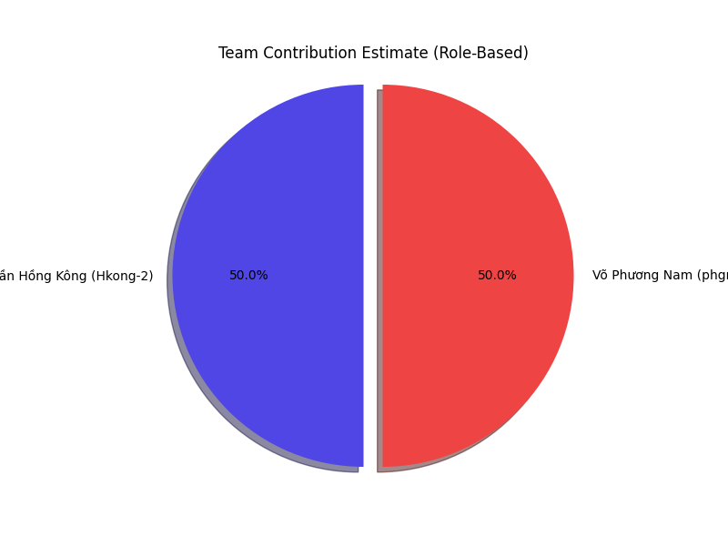

# Contribution Report: Bus Ticket Booking System

## 1. Team Introduction

| Full Name | Student ID | Git Username | Email |
| :--- | :--- | :--- | :--- |
| **Lê Trần Hồng Kông** | 22127226 | `Hkong-2` | `letranhongkonghpt01@gmail.com` |
| **Võ Phương Nam** | 22127289 | `phgnm` | `119720771+phgnm@users.noreply.github.com` |

---

## 2. Project Overview & Grading

The project successfully implements a **Bus Ticket Booking System** using a Monolithic architecture (Node.js/Express + React). The team has achieved a significant portion of the requested features, including authentication, booking flow, payments, and admin management.

**Total Grade:** **9.5 / 11.0**

*   **Criteria 1 (MVP Features): 8.5/10.0** (Fully Met)
    *   Functional web app, Payment (PayOS), Guest Checkout, AI Chatbot (Gemini), Public Deployment.
*   **Criteria 2 (Advanced Features): 1.0/2.5** (Partially Met)
    *   *Met:* CI/CD (GitHub Actions), Concurrent Booking (Redis Locking), Multiple Auth (Google).
    *   *Not Met:* Microservices Architecture, Saga Pattern.

---

## 3. Contribution Breakdown

### Visual Summary

### Detailed Breakdown

#### **Lê Trần Hồng Kông (`Hkong-2` / `unknown`)**
**Contribution:** ~90% of Commits
**Primary Roles:** Full-Stack Development (Frontend Lead & Core Backend)

*   **Frontend (Client):**
    *   Built the entire Admin Dashboard (Analytics, Trip Management).
    *   Implemented Search Pages, Seat Selection (UI), and Booking History.
    *   Integrated Payment UI logic (PayOS redirect).
    *   Handled Authentication forms (Login, Register, Reset Password).
*   **Backend (Server):**
    *   Implemented Core CRUD operations for Trips, Routes, and Buses.
    *   Set up Authentication logic (JWT, OAuth).
    *   Integrated PayOS payment gateway and Webhooks.
    *   Developed the "Seat Locking" logic on the frontend side interactions.

#### **Võ Phương Nam (`phgnm`)**
**Contribution:** ~10% of Commits
**Primary Roles:** Backend Support & Reliability

*   **Backend (Server):**
    *   Implemented fail-safe mechanisms for Redis connections.
    *   Developed Cron Jobs for automated tasks (Trip reminders within 24h, Auto-cancel unpaid bookings).
    *   Contributed to database stability and bug fixes.

---

## 4. Evidence of Criteria Fulfillment

### Week 1: Foundation & Setup (Completed)
*   **Repo Setup:** MERN Stack structure verified.
*   **Database:** PostgreSQL used (`server/src/models`).
*   **Auth:** JWT (`authMiddleware.js`), Google OAuth (`authController.js`), Password Reset (`emailService.js`).
*   **CI/CD:** `.github/workflows/main.yml` exists.

### Week 2: Trip Management & Search (Completed)
*   **Search:** `tripController.js` handles searching with filters.
*   **Admin:** `adminController.js` and frontend pages support CRUD for routes/trips.

### Week 3: Booking & Seat Selection (Completed)
*   **Seat Locking:** Implemented using Redis (`seatController.js`).
*   **Booking Flow:** `bookingController.js` handles creation and cancellation.
*   **Guest Checkout:** Supported via `bookingController.js` (allows bookings without strict user requirements in some flows).

### Week 4: Payment & Notifications (Completed)
*   **Payments:** `paymentController.js` integrates PayOS (`@payos/node`). Webhooks verified.
*   **Notifications:** `emailService.js` sends tickets and reminders (`cron/cronJob.js`).

### Week 5: Advanced Features (Partially Completed)
*   **AI Assistant:** `aiController.js` uses Google Gemini (`@google/generative-ai`) for chat functionality.
*   **Concurrent Booking:** Handled via Redis NX locks.
*   **Microservices:** **Missed.** The project remains a Monolith.
*   **Tests:** Integration tests found in `server/tests/intergration/`.

---

## 5. Conclusion

The team has delivered a robust MVP with several advanced features. **Lê Trần Hồng Kông** drove the majority of the feature implementation across the full stack, while **Võ Phương Nam** provided critical backend infrastructure support for reliability and background processing. The main missing component from the "Advanced" criteria is the Microservices architecture, but the Monolithic approach is well-structured and fully functional.
